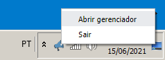

# Announcer

## Propósito

Apresenta avisos avultos e rotativos para a igreja.

## Autoria

Este software foi feito pelos membros da igreja e temos total domínio sobre ele podendo fazer modificações e melhorias.

## Carga a operação

Ao carregar esse software aparentemente nada acontece, a não ser que abre uma janela toda preta.\
Mas se reparar no systray (iconezinhos ao lado do relógio), um ícone novo aparece lá, conforme a imagem abaixo.

A janela preta é aonde vão sair os avisos, no caso do Calvário essa janela fica no segundo monitor, que é capturado pela ATEM.

Se você estiver com a janela focada (barra de título lá em cima azul) e apertar F11 vai ver que a parte preta vai se expandir para a tela toda, isso se chama o modo "tela cheia", se apertar F11 novamente volta a ser uma janela menor.

O programa guarda a última posição dessa janela quando fecha e abre na mesma posição que fechou.\

No Calvário essa janela preta fica quase imperceptível, isso porque o programa abre sozinho quando inicia o Windows, quando ele abre a janela preta já abre sozinha em tela cheia no segundo monitor.

O tela usada para gerenciar os avisos é dentro do navegador.\
Normalmente já tem um atalho no navegador criado para ela, mas é possível abrir se clicar com o botão direito do mouse em cima do ícone e acionar o item "Abrir gerenciador" como na imagem abaixo.

Depois de aberto deve abrir uma página Web como essa da imagem abaixo.

## MIEDUC

O MIEDUC é o ministério que cuida das crianças durante o culto.

Quando os pais deixam suas crianças na "salinha" o professores dão um cartão com uma cor e uma senha.\
A cor do cartão está ligada a salinha que ele foi deixado.\
A senha é um número que está escrito bem grande no cartão.

Quando o MIEDUC precisa que os pais compareçam na salinha para buscar a criança, eles abrem o gerenciador no navegador deles, digitam a senha, a cor e clicam em Executar.

Ao lado do botão executar dá para customizar a quantidade de segundos em que o aviso ficará exibindo, se não colocar nada fica por um tempo padrão.

*Nada impede que eles nos mandem uma mensagem via WhatsApp e nós façamos a digitação, nós fazíamos dessa forma antigamente.*

## Estacionamento

Avisos de estacionamento funcionam da mesma forma que MIEDUC, porém os diáconos que cuidam do estacionamento não acessam diretamento o gerenciador, eles enviam mensagem no nosso WhatsApp exclusivo (temos um celular do ministério para isso), e nós digitamos o modelo e placa do veículo.

Quando clicamos em executar aparece uma mensagem disso para a igreja.

## Genérico

Aqui é possível escrever qualquer mensagem customizada.

Porém é preciso que tomar cuidado com a largura da frase, o Announcer vai diminuir a fonte para que caiba a frase inteira até o Enter.

Então dois cuidados aqui são importantes:
- Pense em textos pequenos e objetivos.
- Quebra a linha apertando Enter quando ficar muito largo (o programa vai te alertar quando ficar muito grande).

## Avisos rotativos

Os avisos rotativos na verdade mostram uma página web qualquer, é só colocar o link na caixa de texto e apertar executar.

O link que já vem escrito quando abre o programa é para uma apresentação do Google Drive que tem imagem de avisos que são feitos por outro ministério.

Os avisos são exibidos até ser apertado o botão Reset.

## Reset

Se quiser remover um aviso ou tirar os avisos rotativos, aperto o botão reset, ele serve para fazer com que o programa volte ao seu estado inicial.

## Opção Stream Deck

No topo da página de gerenciamente existe uma opção chamada "Stream Deck".\
Se essa opção estiver ativada, o Announcer vai interagir com o BitFocus (isso mesmo, a opção deveria se chamar BitFocus), que por sua vez vai interagir com a ATEM, para retirar a transmissão normal das TVs de aviso.\
Quando terminar o aviso o Announcer faz o mesmo procedimento porém dessa vez para voltar a imagem da transmissão que estava antes.

Se essa opção estiver desligada apenas o aviso vai para a janela mas sem acionar nada no BitFocus/ATEM.