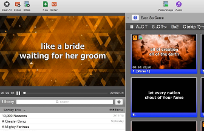
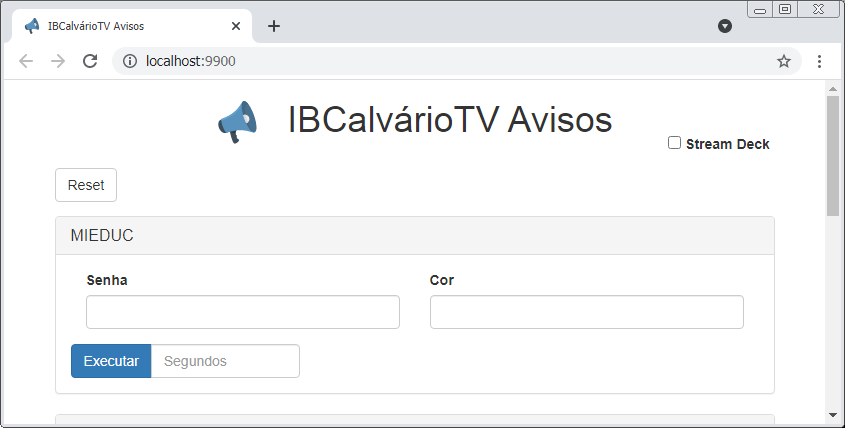

# Broadcast

- [Do que estamos falando?]()
- [Conhecendo os equipamentos e programas]()
  - [ATEM](#atem)
  - [AJA HELO](#aja-helo)
  - [Stream Deck](#stream-deck)
  - [BitFocus](#bit-focus)

## Do que estamos falando?
Broadcast se refere a transmitir de vídeo e som remotamente utilizando meios eletrônicos.\
No nosso caso podemos pensar, a grosso modo, que é quando fazemos o culto aparecer no Youtube ou Facebook.

Mas como utilizamos mais que uma câmera, e por exemplo, embutimos letras dos louvores, agregamos avisos de rodapé e coisas desse tipo, fazemos com que o termo broacast signifique mais do que apenas transmitir eletrônicamente.

**Seria o conjunto de coisas que fazemos para unir diversas ações e gerar um vídeo com tudo isso junto.**

## Conhecendo os equipamentos e programas

### [ATEM](https://www.blackmagicdesign.com/br/products/atemtelevisionstudio/techspecs/W-APS-08)

Esse equipamento nos auxilia a escolher, entre diversas entradas (câmeras, saídas de vídeo de computadores por exemplo) qual delas será utilizado para enviar para produção (resultado final).\
Algum chamam essa função de mesa de corte, pois o operador "corta" de uma cena para outra.\
*Especificações Básicas: 8 Entradas (4 HDMI, 4SDI), 2 Entrada de Áudio, 5 Saídas Program (Ao vivo), 1 Saída Auxiliar, 1 Saída Multiview.*

### [AJA HELO](https://www.aja.com/products/helo)

O AJA HELO é um servidor de streaming e gravação, isso quer dizer que ele é responsável exclusivamente para a transmissão do vídeo para YouTube, Facebook e outros produtos desse tipo.\
Utiliza codificação H.264/MPEG-4 compatível com YouTube, Facebook e outros.\
Suporta apenas 1 destino de streaming por evento, em outras palavras, não pode por exemplo, transmitir para YouTube e Facebook ao mesmo tempo.

### [Stream Deck](https://www.elgato.com/en/gaming/stream-deck)

ELGATO Stream Deck, é um teclado dinâmico utilizado para operar e interagir com o [BitFocus](#bitfocus) ligado via porta USB.\
Seu teclado suporta imagem, textos, tem 15 teclas e 99 páginas.\
As configurações das teclas ficam definidas no BitFocus também.\
**O Stream Deck depende totalmente do BitFocus e tudo que ele faz é através dele.**

### [BitFocus](https://bitfocus.io/companion/)

Esse software opera e interage com outros software e hardwares de áudio, vídeo e transmissão.\
**Ele é a inteligência do [Stream Deck](#stream-deck) que não faz nada sem o BitFocus.**

### [VLC](https://www.videolan.org/vlc/index.pt-BR.html)

VLC é um software gratuito que toca músicas e exibe vídeos em computadores e celulares.

### [ProPresenter](https://renewedvision.com/propresenter/pro6-tutorials/)

Dependendo da utilização pode ser comparado ao PowerPoint pois sua finalidade é exibir apresentações, mas é mais voltado para exibição das letras dos louvores para que a igreja possa ler e acompanhar.\
*Importante considerar que utilizamos a versão 6, que não é a última.*\
TODO: Incluir link para tutorial ProPresenter.

### [Announcer](#https://bitbucket.org/ibcalvario/ibcalvariotv/src/master/ibcalvariotv-announcer/)

Software de autoria e domínio do Calvário que serve para exibir avisos avulsos para os membros da igreja durante o culto.\
Avisos como por exemplo para ir verificar algum problema com o carro no estacionamento, precisa ir no MIEDUC ver alguma ocorrência com o filho/filha, etc...

Também é utilizado para exibir os avisos rotativos antes do início do cultos, isso porque o Announcer é capaz de exibir páginas web.