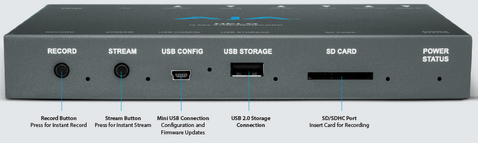

# Broadcast

- [Do que estamos falando?]()
- [Conhecendo os equipamentos e programas]()
  - [ATEM]()
  - [AJA HELO]()

## Do que estamos falando?
Broadcast se refere a transmitir de vídeo e som remotamente utilizando meios eletrônicos.\
No nosso caso podemos pensar, a grosso modo, que é quando fazemos o culto aparecer no Youtube ou Facebook.

Mas como utilizamos mais que uma câmera, e por exemplo, embutimos letras dos louvores, agregamos avisos de rodapé e coisas desse tipo, fazemos com que o termo broacast signifique mais do que apenas transmitir eletrônicamente.

**Seria o conjunto de coisas que fazemos para unir diversas ações e gerar um vídeo com tudo isso junto.**

## Conhecendo os equipamentos e programas

### ATEM
\
[Produto no site do fabricante](https://www.blackmagicdesign.com/br/products/atemtelevisionstudio/techspecs/W-APS-08)

Esse equipamento nos auxilia a escolher, entre diversas entradas (câmeras, saídas de vídeo de computadores por exemplo) qual delas será utilizado para enviar para produção (resultado final).\
Algum chamam essa função de mesa de corte, pois o operador "corta" de uma cena para outra.\
*Especificações Básicas: 8 Entradas (4 HDMI, 4SDI), 2 Entrada de Áudio, 5 Saídas Program (Ao vivo), 1 Saída Auxiliar, 1 Saída Multiview.*

### AJA HELO
\
[Produto no site do fabricante](https://www.aja.com/products/helo)

O AJA HELO é um servidor de streaming e gravação, isso quer dizer que ele é responsável exclusivamente para a transmissão do vídeo para YouTube, Facebook e outros produtos desse tipo.\
Utiliza codificação H.264/MPEG-4 compatível com YouTube, Facebook e outros.\
Suporta apenas 1 destino de streaming por evento, em outras palavras, não pode por exemplo, transmitir para YouTube e Facebook ao mesmo tempo.