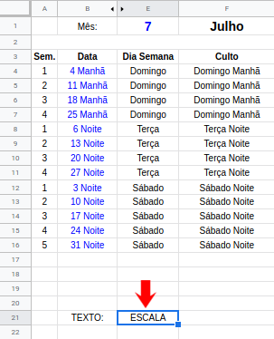

# Escala da operação
{: .no_toc}

Índice
* TOC
{:toc}
---

A escala atual sempre deve ficar nessa [planilha do Google Sheets](https://docs.google.com/spreadsheets/d/12Di-Q-osf4sGJz-7UQ9myvMxMxS5hJ55PSrN645E9bw).

Esta planilha contém uma inteligência de preenchimento automático.

**O conteúdos de todas as abas tem efeito para o algoritmo de preenchimento automático, nada aqui é apenas para registro.**

## Aba Participantes
Declara a disponibilidade de cada um.

Essa aba tem essas informações não somente para deixar isso registrado.

Essa aba deve ser alterada sempre que uma pessoa pode ir um dia do semana ou deixa de poder ir.

As colunas devem conter o equivalente a coluna Culto da aba Escala junto com o papel desempenhado.\
**O texto deve ser exato só funciona assim.**

## Aba Histórico

Aqui, cada participação que aconteceu deve ser marcada com um x na célula equivalente.

O importante é a coluna de total, isso vai ser levado em conta no preenchimento automático pois **serão priorizadas pessoas que participaram menos**.

## Mudando o mês

Quando muda o mês as seguintes informações devem ser alteradas.
- Número do mês
- Ano
- Sequencial da semana
- Data *(dia + período)*

Caso seja preciso criar mais linhas as fórmulas devem ser copiadas e coladas da linha de cima.

# Publicando a escala

Antes de publicar deve-se:
- Revisar a formatação
- Incluir em cada culto o horário de chegada manualmente
- Ressaltar a ceia e colocar dois coordenadores
- Validar distribuição com os coordenadores
  - A escala automática pode fazer repetições que não são legais

A publicação da escala deve ser feita pelo líder do ministério ou a quem ele delegar.

A escala deve ser publicada no grupo do ministério copiando da célula apontada na imagem abaixo.

