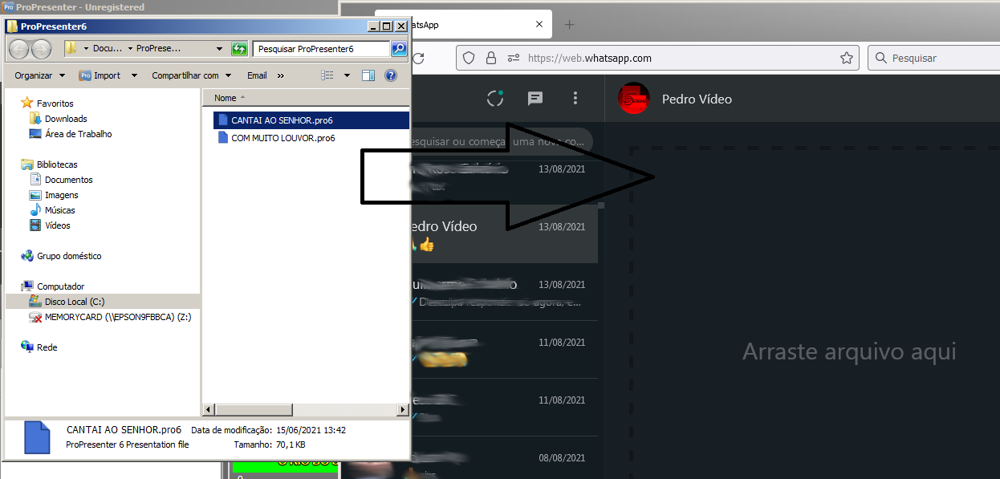

# Persistir louvor editado na igreja
{: .no_toc}

Índice
* TOC
{:toc}
---

## Entenda o contexto
Os louvores ficam persistidos em um repositório git, isso quer dizer que:
- Salva histórico de tudo que acontece.
- Tem controle de permissões de quem pode apenas ler e quem pode alterar.

Pra facilitar o entendimento pense em um repositório Git como se fosse uma pasta que fica salva em um computador que fica ligado na internet 24 horas por dia.

A equipe de revisão pode alterar, a equipe de operação não pode alterar, apenas ler.

A impressão de quem está na operação é de que pode alterar os louvores, isso porque o ProPresenter deixa alterar.

Mas o que está sendo alterado é uma cópia que está só no computador local lá na igreja. Toda vez que o computador essa pasta com os louvores voltam a ser igual é no repositório Git, ou seja, nesse momento perde-se todas as alterações feitas ali na hora.

Optamos por trabalhar assim porque senão a equipe de revisão perde o controle do que está sendo alterado nas letras uma vez que a equipe de operação tem muita gente e que não vão prestar atenção nos [detalhes](..) da edição.

## O problema

Mas imagine que você fez uma alteração importante no louvor e sabe que é uma alteração que faz sentido para todos os cultos e não só no culto em que você está atuando.\
Sendo assim você pensa que é bom que a equipe de revisão altere aquilo e fique salvo no repositório Git e não precise ficar alterando toda vez.

**Como fazer nesse caso?**\
Você vai ter que enviar manualmente o arquivo para a equipe de revisão.\
Abaixo vamos te ensinar como enviar o arquivo pelo WhatsApp Web.

## Abra o arquivo no Windows Explorer
Clique com o botão direto do mouse sobre o louvor, seja na lista de reprodução ou no buscador. Selecione a primeira opção.

## Arraste o arquivo para o WhatsApp Web
Primeiro selecione a pessoa para quem você quer enviar, ela deve fazer parte do grupo de revisão.

Dentro do Windows Explorer, arraste o arquivo para a página do WhatsApp Web e depois clique na setinha para enviar.

## Converse com a pessoa da revisão
Explique para a pessoa o que você fez de alteração e porquê precisou fazer.

**Importante:** Não se ofenda caso ela altere alguma coisa do que você fez, o papel dessa pessoa é ser criteriosa nesse ponto.