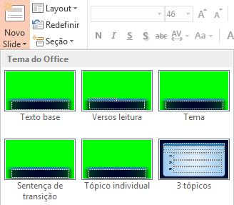
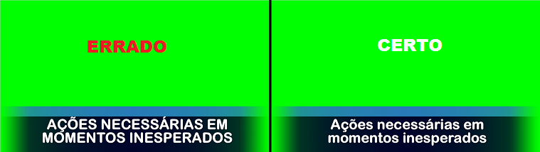
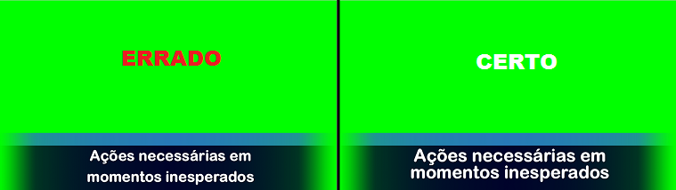
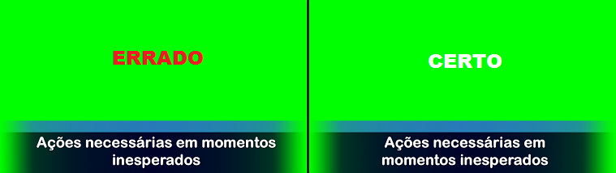

# Criação do PowerPoint da Palavra
{: .no_toc}

Índice
* TOC
{:toc}
---

## Formato do arquivo
Estamos utilizando o PowerPoint 2013 com a extensão [pptx](https://support.microsoft.com/pt-br/office/formatos-de-arquivo-aos-quais-o-powerpoint-oferece-suporte-252c6fa0-a4bc-41be-ac82-b77c9773f9dc).

**É altamente recomendado utilizar a mesma versão ou validar a compatibilidade afim de evitar problemas na hora do culto.**

## Slides mestres
No PowerPoint estamos utilizando o recurso de slides mestres afim de manter uma padronização.

Não altere fontes, estilo, negrito, itálico, tamanhos, etc... 

## Exceções
Caso o pregador peça algo que fuja do que foi estabelecido nesse documento, tente negociar explicando que existe toda uma logística por trás.

Caso ele insista, compartilhe o caso com o grupo que cuida desse tema ou avise porsteriormente caso não tenha tempo hábil para isso.

## Ordem dos slides
Os slides devem sempre seguir essa ordem.
- Texto base\
  *Referência bíblica.*
- Leitura dos versículos\
  *Texto bíblico escrito por extenso para que a igreja acompanhe a leitura, máximo de três linhas por slide, desejável uma ou duas.*
- Tema\
  *Tema da pregação.*
- Sentença de transição\
  *Opcional, texto que indica do que se tratam os tópicos a seguir.*
- Tópicos\
  *Um slide para cada tópico da pregação.*
- Resumo\
  *Slide único com todos os tópicos que é apresentado no final da pregação.*

## Textos com as letras maiúsculas
Não se deve usar textos com todas as letras maiúsculas, mesmo em palavras isoladas.

## Quebra de linha
Se atentar ao usar Enter ou Shift+Enter no PowerPoint, quando aperta Enter está se criando um novo parágrafo, o que cria um espaço maior.

Shift+Enter deve ser sempre utilizado no caso do PowerPoint da palavra.

## Copiar e colar
Quando se copia e cola (Ctrl+C e Ctrl+V) do navegador, Word ou outro programa, pode-se copiar também a formatação (fonte, cor, tamanho e estilo).

Isso é ruim pois não podemos mudar essas coisas na apresentação.

Uma técnica para evitar isso é colar o texto no [Bloco de Notas](https://pt.wikipedia.org/wiki/Bloco_de_Notas) e aí copiar novamente para depois então colar no PowerPoint.

Um texto copiado do Bloco de Notas vem livre de formatação.

## Larguras de texto próximas
Quando estiver escrevendo em um bloco de texto com mais que uma linha, procure manter as larguras das linhas o mais próximas possível.

*Isso não se refere ao PowerPoint todo, os textos são diferentes por slide e a busca por larguras próximas deve acontecer dentro do contexto de cada slide.*

## Referência ao texto bíblico da pregação
- Nunca utilizar nomes de livros abreviados
- Formato para apenas um versículo
  - Livro + Espaço + Capítulo + Dois pontos + Espaço + Versículos
  - *Exemplo:* João 3: 16
- Formato para intervalo de versículos do mesmo capítulo
  - Livro + Espaço + Capítulo + Dois pontos + Espaço + Versículo inicial + Traço + Versículos final
  - *Exemplo:* João 1: 1-4
- Formato para vários versículos do mesmo livro
  - Usar outras regras, somente separando por vírgulas.
  - Se livro ou capítulo for igual ao anterior não precisa repetir.
    - *Exemplo de múltiplos versículos do mesmo livro e capítulo.*\
    João 1: 1,5,8
    - *Exemplo de múltiplos versículos do mesmo livro, porém de capítulos diferentes.*\
    João 1: 3, 2: 1, 3: 4
    - *Exemplo de múltiplos versículos de livros diferentes.*\
    João 1: 3, Lucas 2: 7
    - *Exemplo de combinação entre os exemplos anteriores.*\
    João 1: 3, 2: 1, Lucas 2: 7

## Referências ao versículos como citação nos tópicos.

  - *Formato quando é apenas um versículos é como abaixo:*\
    (v. 14)
  - *Formato para múltiplos versículos:*\
    (v. 14, 15 e 16)

## Publicação
Ao terminar a criação da apresentação deve-se publicar no grupo de WhatsApp responsável por esse tema.

O passo seguinte a esse é copiar o arquivo para a pasta sincronizada (Google Drive), essa tarefas deve ser feita pelos que estão no grupo do WhatsApp seguido por uma notificação (mensagem) ao grupo de que o arquivo foi copiado.

Os coordenadores da operação do ministério devem estar no grupo de WhatsApp e, caso haja algum problema com a sincronização, eles devem baixar o arquivo que receberam por algum meio alternativo como WhatsApp Web por exemplo.

Também é possível que o pregador não envie o conteúdo a tempo, nesse caso a edição terá que ser feita diretamente na igreja, salvando na pasta sincronizada.

## Vídeo de demonstração

A idéia do vídeo abaixo é facilitar a compreensão mostrando na prática, como criar o PowerPoint da Palavra.

**Se aqui no vídeo, algo não estar compatível com as regras definidas acima, o que deve prevalecer são as regras escritas no documento, não o que aparece no vídeo.**

<video width="100%" controls>
  <source src="criacao-power-point-palavra.mp4" type="video/mp4">
</video>