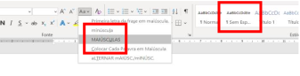
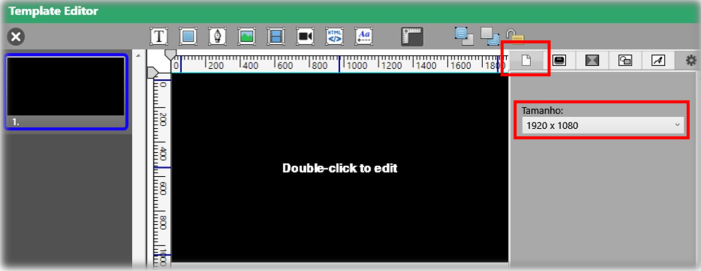
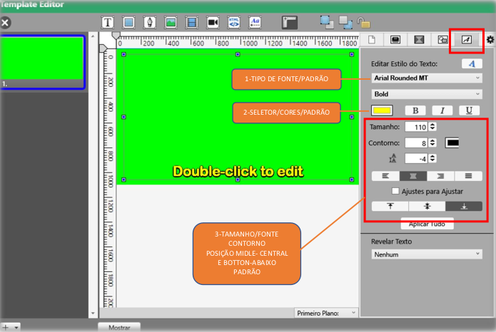
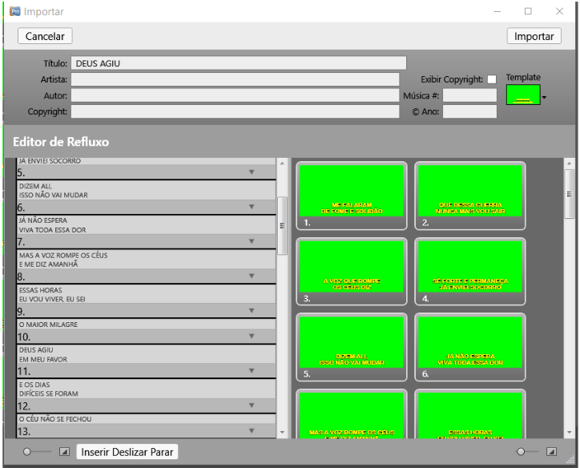
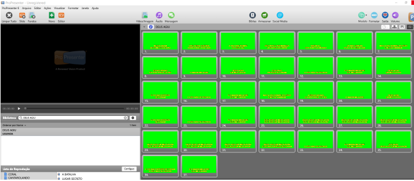

# Criação de louvor no ProPresenter
{: .no_toc}

<button name="Back" onclick="window.history.back()">Back</button>

Índice
* TOC
{:toc}

Aqui iremos como criar novos louvores para o Pro Presenter. Para mais informações sobre o software e como opera-lo veja [aqui](../equipamentos-e-programas/propresenter/index.md).

<!-- Colocar imagem de exemplo do chroma key -->

## Criando um novo louvor

Para criarmos um novo louvor é necessário criar um arquivo e inseri-lo no Pro Presenter usando o padrão.

### Criando o arquivo

Primeiramente pegue a letra do louvor desejado, seja na internet ou outra fonte. Depois crie um arquivo usando essa letra.

Para criar o arquivo de letras, pode ser usado um editor de texto como o **Bloco de Notas** , Word  ou Notepad++ . É aconselhável que o editor escolhido tenha opção de deixar todas as letras em caixa alta (Maiúsculas), pois esse é o padrão das letras na igreja, e permitir controlar trocar a codificação para Ansi.

* O **Bloco de Notas** permite alterar a codificação, mas não alterar todas as letras para maiúscula.

* O **Word** permite alterar todas as letras para maiúscula, mas não alterar a codificação.

* O **Notepad++** permite as duas funções.

|  |
|:--:|
| *Alterando codificação no Notepad++* |

|  |
|:--:|
| *Alterando letras para maiúsculas no Notepad++* |

Portanto é possível usar o Word em conjunto com o Bloco de Notas ou o Notepad++.

Copie e cole a letra desejada no editor e separe em conjuntos de linhas o louvor desejado segundo o padrão desejado:

| |  | | |  | |
| | :--:                                       | | | :--:                                         | |
| | *Banda: No máximo duas linhas*             | | | *Jovens: No máximo cinco linhas*             | |

Sempre tenha o cuidado de separar as linhas de forma a facilitar a operação. Isso pode ser feito: 

* Observando como música é cantada;
* colocar partes que são cantadas juntas próximas;
* repetir as estrofes conforme são cantadas.

> &#9888; Muitas vezes o louvor é cantado de forma diferente na igreja em relação ao original. Por isso busque ouvir o louvor, seja de cultos anteriores, no ensaio ou através de nossa [audioteca](https://www.dropbox.com/sh/0qsq9cuuwt9zjec/AAAA8-EbGFNkeiE3NZj5GXZea?dl=0&lst=) <!-- Adicionar link -->.

### Modelo

Vamos ver como criar um novo modelo segundo o padrão da igreja. Tanto para usa-lo caso não tenha no PC, quanto para entender suas características.

* Abra o Pro Presenter

* Na parte inferior esquerda clique na seta ao lado do simbolo **"+"** e clique em **Criar novo Modelo**.

* Uma tela irá se abrir para salvar o novo modelo. Coloque um nome (exemplo "PADRÃO LEGENDA IBCAL") e clique em salvar.

* Será aberto uma janela de edição de slide, onde iniciaremos a edição do nosso modelo.

* Primeiramente altere o Tamanho para 1920 X 1080

* Altere o fundo para a cor verde.

* Por ultimo altere o estilo de texto conforme a imagem a baixo.

E com isso está finalizado o nosso modelo. Agora podemos usá-lo como base para os louvores seguintes.

### Importando o Arquivo

Tendo o modelo pronto, vamos importar o arquivo que foi criado anteriormente dentro do pro presenter. Para isso abra o pro presenter e na parte superior clique em Arquivo -> Importar -> Importar Arquivo...

Indique o local do arquivo e uma janela irá aparecer. Preencha conforme abaixo:

Clicando em editar veremos como o arquivo foi importado e também permite alterar o nome. Sempre coloque o nome em letras maiúsculas:

Se tudo estiver correto clique em Importar e pronto um novo louvor será inserido no pro presenter

