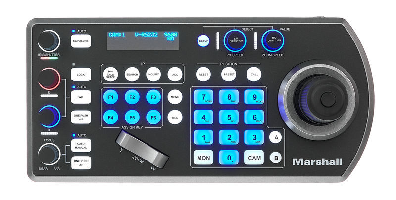
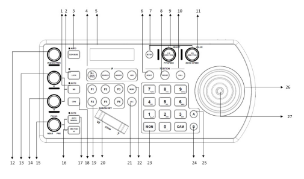

# Controlador de PTZs VS PTC IP

[Manual oficial](https://www.marshall-usa.com/pdf/Marshall_VS-PTC-IP_manualV3.pdf)

## Relação dos botões

Há várias funcionalidades no controlador de cameras, porém apenas algumas são utilizadas pelos operadores de PTZ. Estas são (Os números representam os números na imagem acima):

5. Tela de LCD - Mostra informações como, qual camera está, se é possivel mexer, se preset foi salvo etc.
8. Preset - Usado para salvar presets (Pressione e segure até que na tela apareça que o preset foi salvo).
9. Controlador da velocidade do Pan (movimento horizontal) e Tilt (movimento vertical).
10. Carga de preset - Sempre a cena só será chamada quando ele for pressionado.
11. Controlador da velocidade do zoom.
15. Controlador do foco da câmera.
16. Foco em um toque - pressione e espere até que ele ajuste totalmente.
17. Alternador entre foco automatico e manual - as funções 15 e 16 não funcionaram caso o foco automatico (indicado pela luz azul) estiver ligado.
19. Botões configuraveis - Botões usados para chamar funções automaticamente. Para ver as funções gravadas vá para [Botões Configuráveis](#botoes_configuraveis).
20. Botão de Zoom - abre e fecha o zoom sendo W para aproximar e T para afastar.
23. Teclado numérico - usados principalmente para escolher uma cena.
26. Joystick da PTZ - usado para movimentar a camera (movendo o para a posição desejada) ou alterar zoom (girando o Joystick).

## Botões Configuráveis {#botoes_configuraveis}

|Botão| Função|
|----| ----|
|F1 | Troca para a camera central|
|F2 | Troca para a camera lateral esquerda|
|F3 | Troca para a camera lateral direita|

TODO: Colocar imagens da tela LCD

TODO: Acrescentar gifs de exemplo