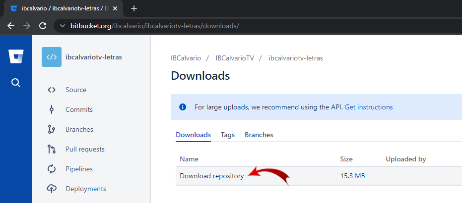
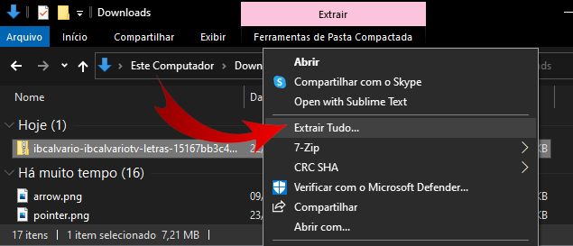
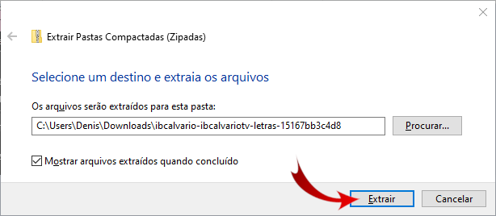
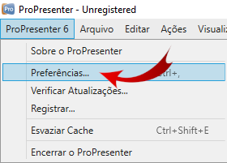
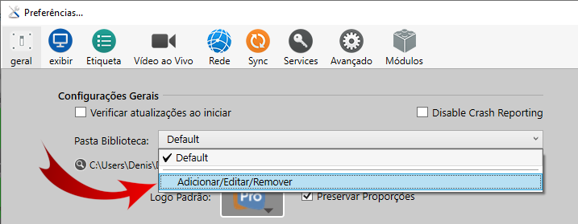
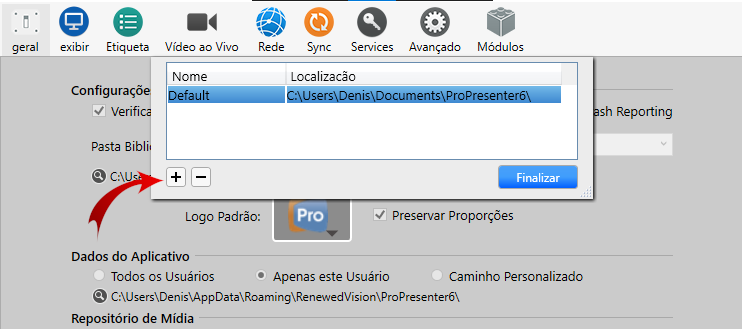
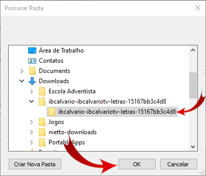
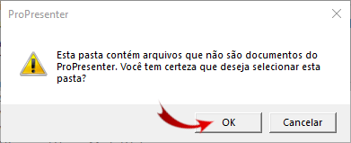
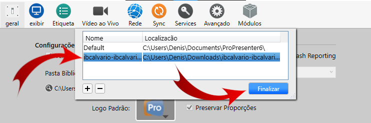
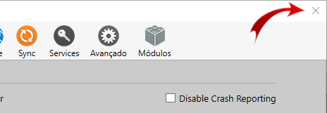

# Baixando e testando o ProPresenter em qualquer lugar
{: .no_toc}

Índice
* TOC
{:toc}
---

## Pra que isso pode ser útil

Esse tutorial mostra como baixar o ProPresenter de qualquer lugar para que você possa treinar.

Mas não precisa ficar limitado a isso.\
Imagine que você pode usar as letras em algum projetor/TV em qualquer situação desde que você tenha com computador/notebook com Windows.\
O único inconveniente é que, sem comprar a licença, o ProPresenter apresenta o logotipo do ProPresenter em marca d'água na visualização final.

## Instalar o ProPresenter

Através desse link você pode baixar a última atualização do [ProPresenter 6](https://renewedvision.com/downloads/pc/ProPresenter6_Win_6162.zip).\
Se você for no site do ProPresenter e baixar uma versão mais nova devem haver incompatibilidades.

Depois de baixar esse zip é necessário:
- Descompactar o arquivo.
- Executar o aplicativo de instalação.
- Seguir o passo-a-passo que o aplicativo de instalação fornece até o fim.

## Baixar as letras utilizadas na igreja

Entre nessa [página](https://bitbucket.org/ibcalvario/ibcalvariotv-letras/downloads/).
Clique no link indicado pela imagem abaixo.

## Descompacte o arquivo ZIP

- Clique com o botão direito do mouse sobre o arquivo baixado.
- Selecione a opção extrair tudo.
- Aperte o botão Extrair.

## Incluir nova pasta como biblioteca

- Entre no menu "ProPresenter 6", "Preferências...".
- No item "Pasta Biblioteca" selecione "Adicionar/Editar/Remover".
- Pressione o botão com o sinal de mais.
- Escolha a pasta aonde estão contidos os todos os louvores.
- Pressione "Ok" na mensagem de confirmação.

## Selecionar a nova biblioteca
- Selecione a nova biblioteca e pressione "Finalizar".
- Feche a janela "Preferências".

