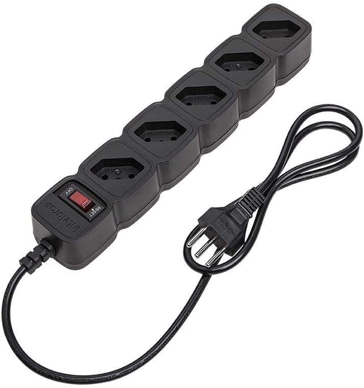
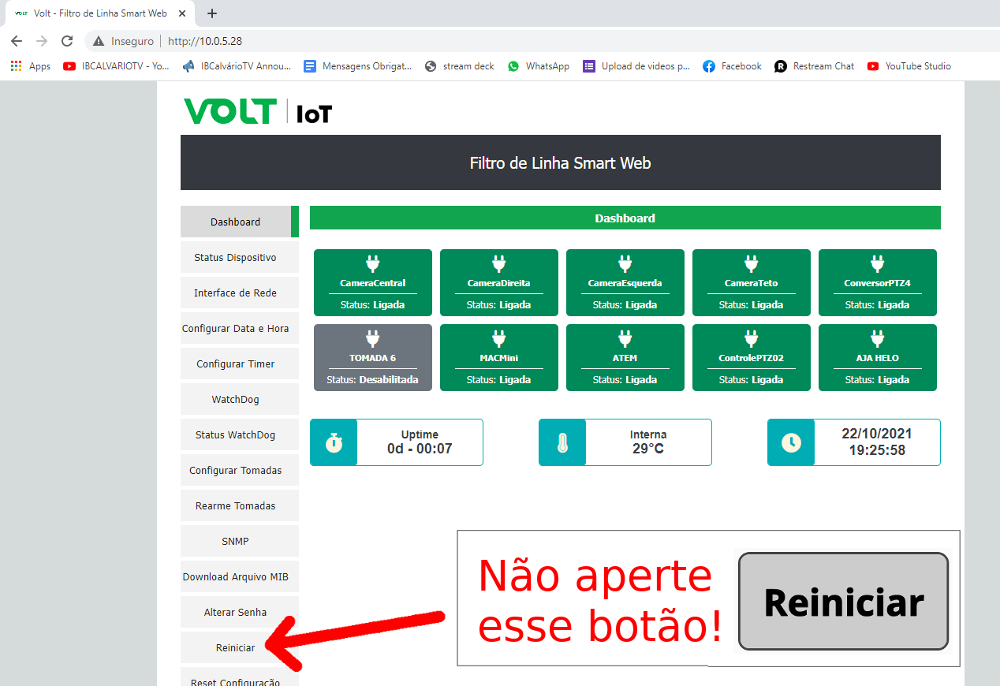
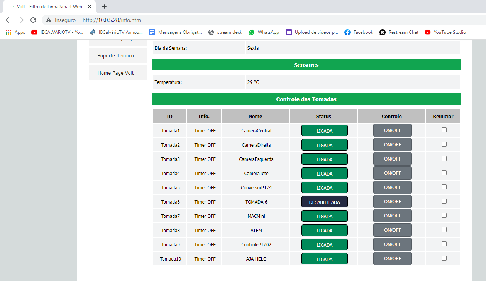

# Régua de Energia Inteligente
{: .no_toc}

Índice
* TOC
{:toc}
---

## Introdução
Esse componente é capaz de ligar ou desligar cada tomada individual dos equipamentos que estão ligadas nela.

Vamos colocar uma foto abaixo de uma régua comum, a foto não corresponde ao equipamento certo, é apenas uma ilustração.

Pense que você pode ter uma chave de liga/desliga para cada uma dessa entradas separadamente, mas faz isso pelo computador, mais especificamente pelo navegador usando uma [interface web](http://10.0.5.28).

## Não aperte esse botão!

O botão destacado na imagem reinicia todos os equipamentos de uma vez.\
CLICOU REINICIA TODOS OS EQUIPAMENTOS, SEM CONFIRMAÇÃO.

## Página de controle

Clicando no segundo botão da barra da esquerda "Status Dispositivo" vamos para uma página aonde é possível ligar ou desligar os equipamentos.

Para ligar ou desligar clique no botão "ON/OFF" correspondente ao equipamento.

Use com cuidado!

