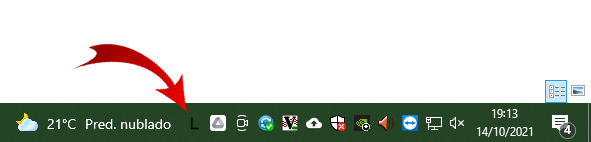
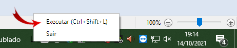

# Tray Lyrics
{: .no_toc}

Índice
* TOC
{:toc}
---

Quando quiser que as legendas do [ProPresenter](/ibcalvariotv/transmissao/equipamentos-e-programas/propresenter/) ou apresentação do PowerPoint apareçam para a igreja é necessário habilitar o botão Letras do [Stream Deck](/ibcalvariotv/transmissao/equipamentos-e-programas/#stream-deck).

## Como saber se o aplicativo está aberto.
Este aplicativo não tem janela, apenas um ícone ao lado do relógio como na imagem abaixo.

## Ativando o botão Letras
Isso pode ser feito por este aplicativo de três formas.

### Duplo-clique
Clique duas vezes no ícone principal.\

### Menu
Clique com o botão direito do mouse no ícone principal e selecione a opção Executar.\

### Tecla de atalho.
