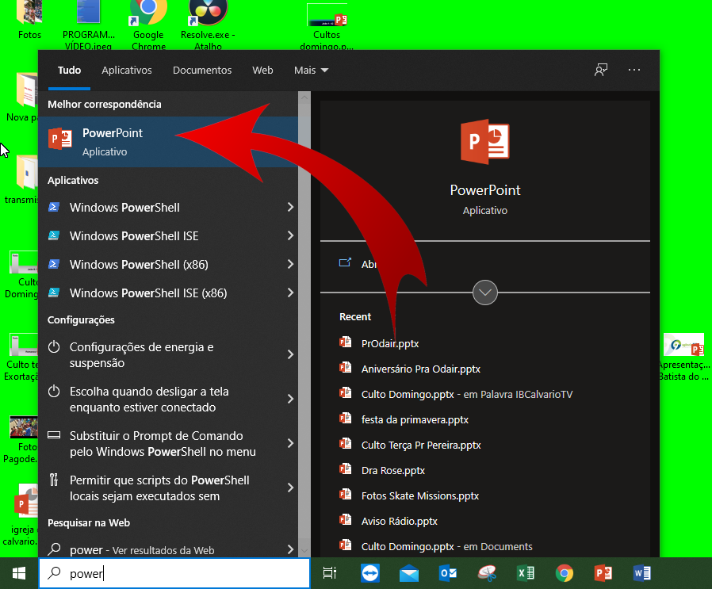
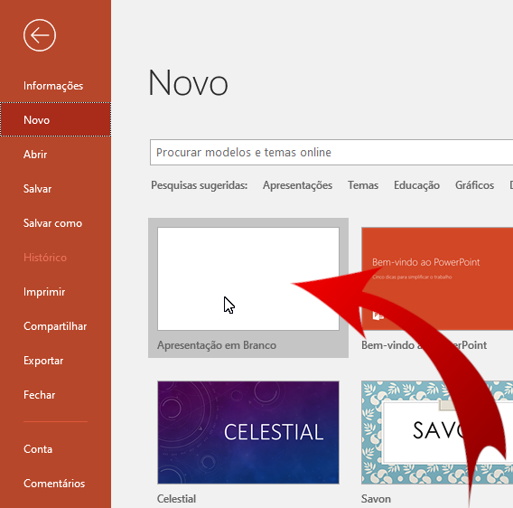
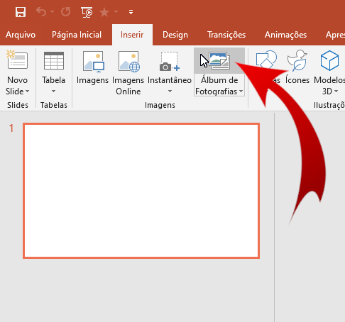
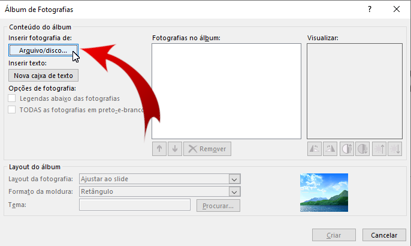
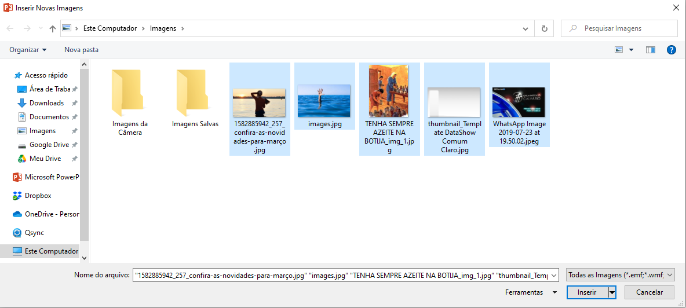
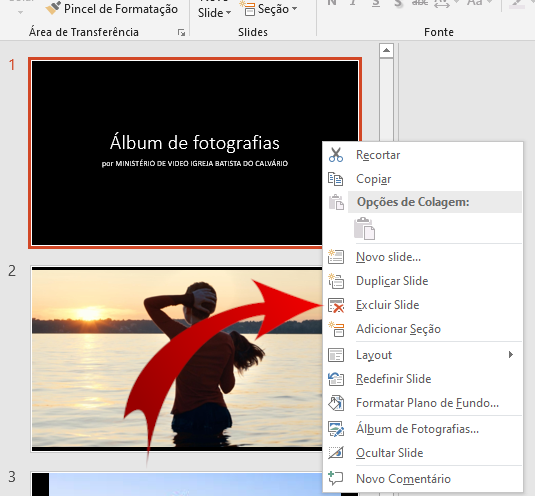
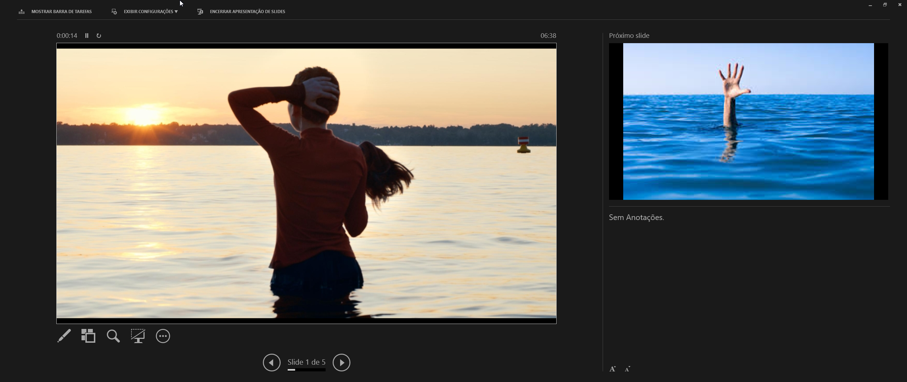

# Reprodução de fotos no PC de letras

## Abra o PowerPoint
O primeiro passo é abrir o PowerPoint, é com ele que vamos gerenciar a apresentação das imagens no segundo monitor que vai para a ATEM.

## Crie uma nova apresentação

## Clique em Álbum de Fotografias

## Clique em "Arquivo/disco..."
Clique neste botão para escolher arquivos que estão salvos no computador.

## Escolha os arquivos
Selecione os arquivos e clique em Inserir.

## Remova o primeiro slide
O primeiro slide é um slide de descrição, não precisamos disso, clique com o botão direito do mouse sobre o slide na barra da esquerda e escolha a opção "Excluir Slide".

## Pressiona F5 para apresentar
Isso vai fazer com que as fotos apareçam no segundo monitor.

## Pressione o botão no Stream Deck
TODO: Pendente concluir.