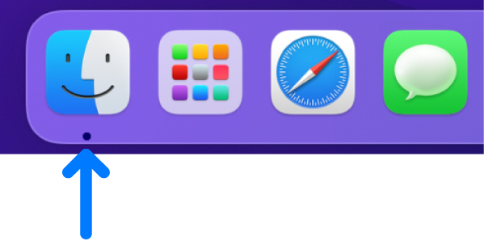
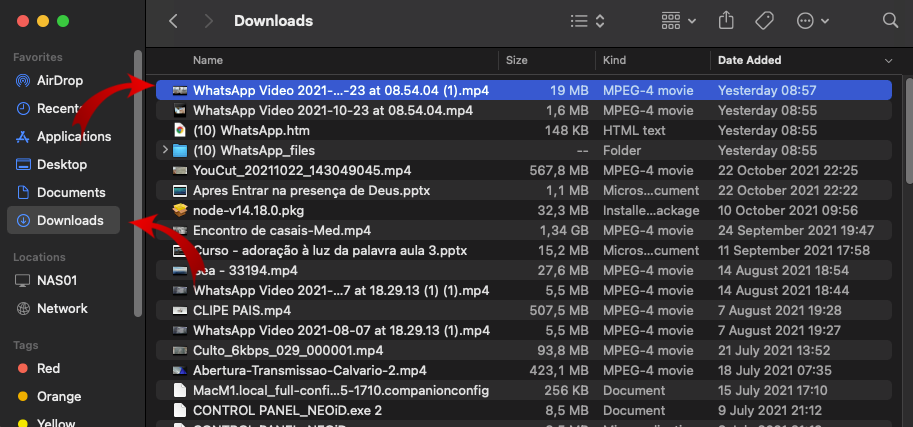
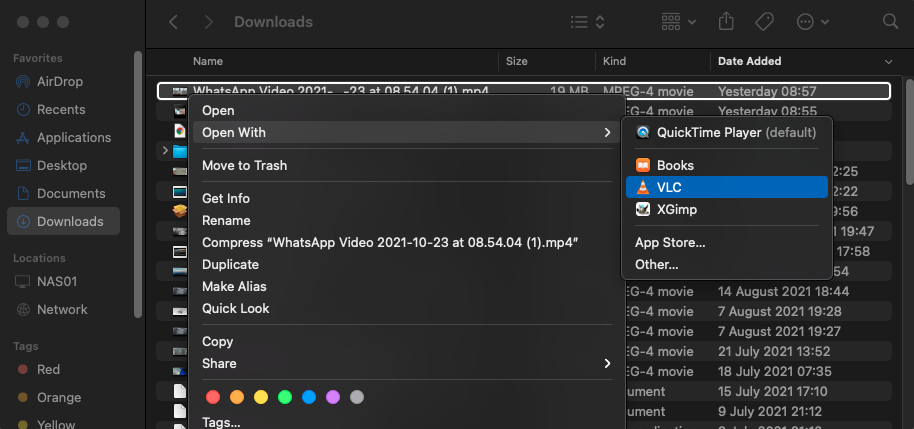
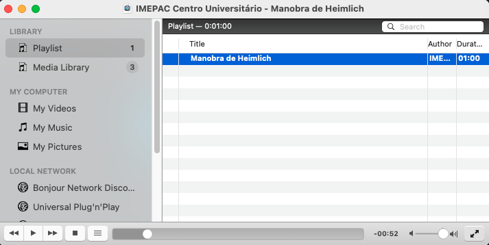

# Reprodução de vídeos no Mini-Mac

## Abra o Finder
Esse programa é se navega entre os arquivos do computador.

## Selecione o arquivo
- Escolha a pasta aonde está o arquivo, Downloads é uma pasta comum para isso.
- Verifique se o arquivo está na pasta como esperado.

## Abrindo vídeo no VLC
Clique com o botão direito do mouse sobre o arquivo e siga o caminho da imagem.

## Duplo clique para começar a reproduzir
Clique duas vezes sobre o vídeo dentro do VLC como na imagem.

