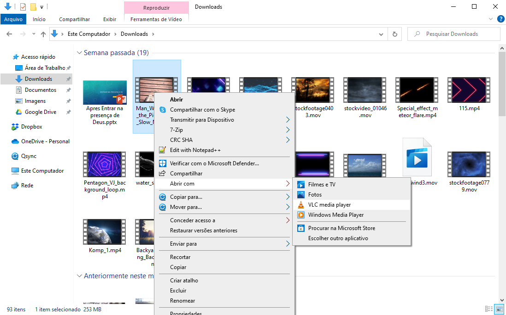
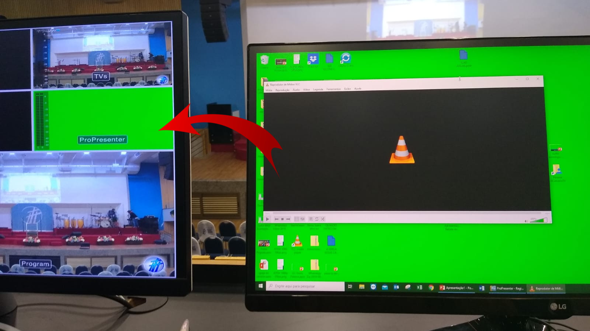
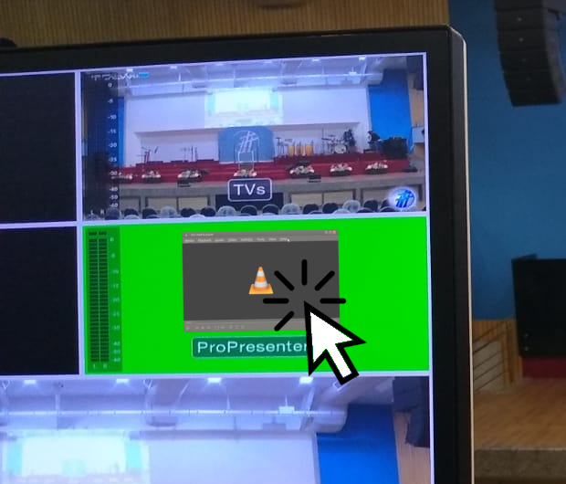
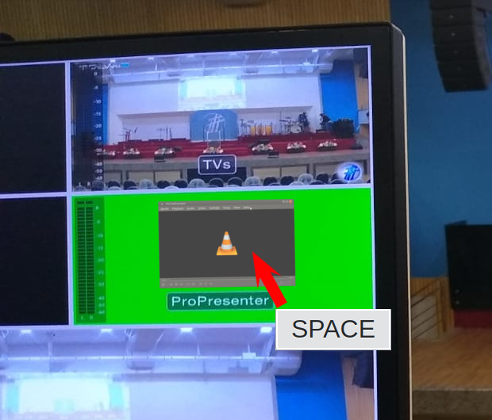

# Reprodução de vídeos no PC de letras ou avisos

Importante considerar que, quando abrir por qualquer um desses computadores **NÃO VAI SAIR SOM**.

## Abrir arquivo no VLC
Clique no arquivo com o botão direto do mouse e siga o caminho indicado pela imagem.

## Arrastar saída para a segunda tela
A saída só vai aparecer para a igreja se você mover manualmente a janela para o segundo monitor que aparece no Multi-view.

## Clique duas vezes sobre o vídeo para expandir
Vá com o mouse para a esquerda até passar a tela principal e poder ver o cursor movendo no Multi-view.

Quando isso acontecer clique duas vezes sobre o vídeo e veja que a tela vai ficar toda preenchida.

## Aperta a tecla espaço
Selecione a janela do VLC lá no monitor do Multi-view e aperte a tecla espaço do teclado para iniciar ou pausar.
