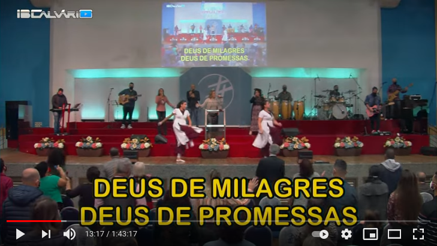
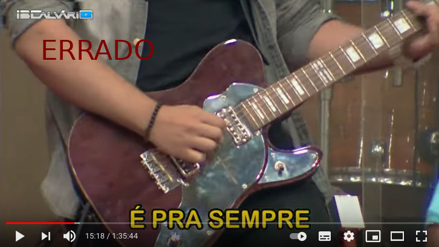

# Tarefas do Controlador de Imagens durante o culto
{: .no_toc}

Índice
* TOC
{:toc}
---

TODO: Revisar e terminar

TODO: Usar esse [vídeo](https://youtu.be/CFmrBNZVsIs) como referência.

TODO: Citar os momentos de atençao citando o vídeo de referência posicionado no momento propício utilizando o parâmetro "t" do YouTube, como nesse [exemplo](https://youtu.be/CFmrBNZVsIs?t=839).

## Início da transmissão
Durante a reprodução do vídeo de abertura certifique-se de que a câmera central está com foco no ministro.

## Durante o louvor
...

### Priorizar mais as cenas abertas mostrando o grupo
Independente da câmera, utilize foi combinado com a liderança da igreja que seriam priorizadas mais as cenas abertas com a igreja.

Nos momentos em que o louvor sinalizar que alguém estiver em evidência devemos focar mais na pessoa, [mas não focar no instrumento](#focar-na-pessoa-ou-grupo-e-não-no-instrumento), isso deve acontecer em solos por exemplo.

Exemplos de cena aberta (clique para ver no vídeo):
\

### Focar na pessoa ou grupo e não no instrumento
Quando for o momento pedir evidência a alguém, focar na pessoa com meio corpo, não focar no instrumento, conforme ilustrado abaixo.

\

## Durante a palavra
...

## Apelo ou final da palavra
...