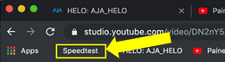
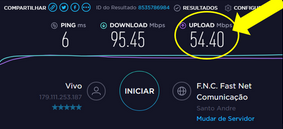
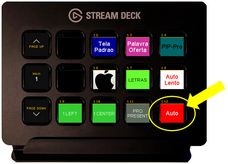
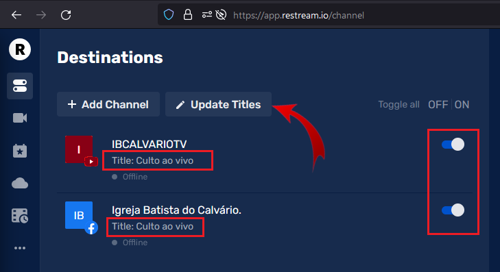

# Tarefas do início de culto

## Controlador de imagens

### Conferir sinal de Internet
No [Mac](/ibcalvariotv/transmissao/equipamentos-e-programas/#auxiliar-de-transmissao) abra o browser Chrome e clique no link para o site do SpeedTest, depois clique em INICIAR.\

Se o resultado do Upload for inferior a 10Mbps verifique isso na página de solução de problemas.\
TODO: Criar link para troubleshooting.\

### Testar o Stream Deck
Após logar com o usuário IBCALTV no [MAC](/ibcalvariotv/transmissao/equipamentos-e-programas/#auxiliar-de-transmissao), verifique se o [Stream Deck](/ibcalvariotv/transmissao/equipamentos-e-programas/#stream-deck) está funcionando corretamente, pressionando a tecla "Auto" e verifique se o conteúdo do preview foi transacionado para o program.\
Se o mesmo não estiver funcionando, verifique o troubleshooting.\
TODO: Criar link para o troubleshooting.\
*Reiniciar [BitFocus](/ibcalvariotv/transmissao/equipamentos-e-programas/#bitfocus) se não estiver funcionando.*

### Definir "Culto ao Vivo" no Restream
Entre na pagina do Restream e verifique se o nome da transmissão no youtube e facebook está como **Culto Ao Vivo**.

**Importante** também verificar se os canais esto ativos através das opções de liga/desliga na direita.

Caso os títulos estejam errados, troque o nome para **Culto ao Vivo** clicando no boto `Update Titles`.

### Conferir vídeo de abertura no VLC e testar {#testar_vlc}
TODO: Precisa terminar.

### Calcular horário do play do vídeo de abertura
Verifique quanto tempo tem o video de abertura e, considerando o horário de inicio do culto, calcule quando inicia-lo.

### Testar saída do Mac {#testar-saida-do-mac}
Com um vídeo passando no [VLC](/ibcalvariotv/transmissao/equipamentos-e-programas/#vlc) do [Mac](/ibcalvariotv/transmissao/equipamentos-e-programas/#auxiliar-de-transmissao), pressione a tecla MAC no Stream Deck, confira se está saindo no Program.
