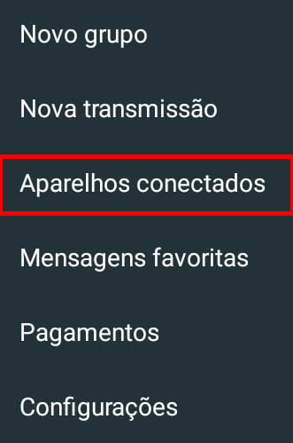
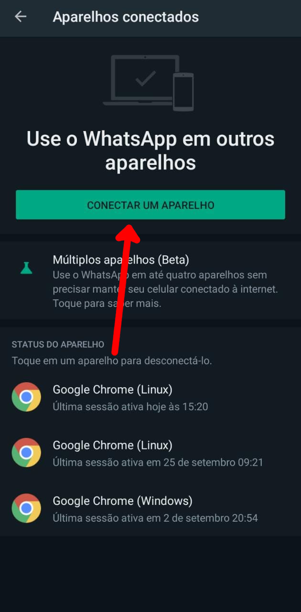
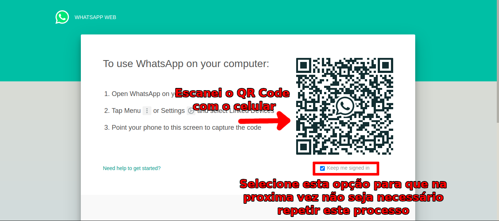

# Tarefas do início de culto

## Moderador do chat e áudio

### Ligar todas as TVs
- Primeiramente verifique se tudo está ligado e alguma imagem está sendo transmitida;
- Em cada tv, na lateral direita, há dois botões. Pressione o botão de baixo para ligar a TV. 
- Espere até que a tv ligue e verifique se a imagem é transmitida nela.

### Testar página Stream Deck

### Ativar avisos

### Testar fone de ouvido
- Pegue o fone de ouvido na gaveta
- Pluge o cabo no fone
- Pluge o cabo em um cabo conectado ao monitor do pc de avisos
- Abra um video no youtube (Por exemplo um video culto gravado)
- Verifique se o audio está saindo no fone
- Caso não saia verifique se o som do pc e do video do Youtube estão ligados

### Ativar o WhatsApp Web
- Abra o [WhatsAPP Web](https://web.whatsapp.com/) no pc de avisos

Se o celular não estiver conectado siga os seguinte passos
- Abra o Whatsapp no celular
- Clique no icone de três pontos para abrir as opções

- Selecione a opção **Aparelhos conectados**

- Clique no botão **CONECTAR UM APARELHO**

- Escaneie o QRCode para conectar o Whatsapp

