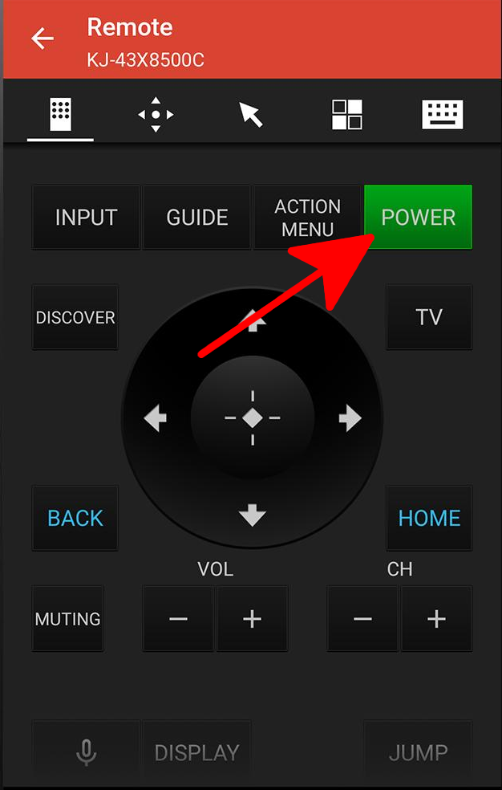
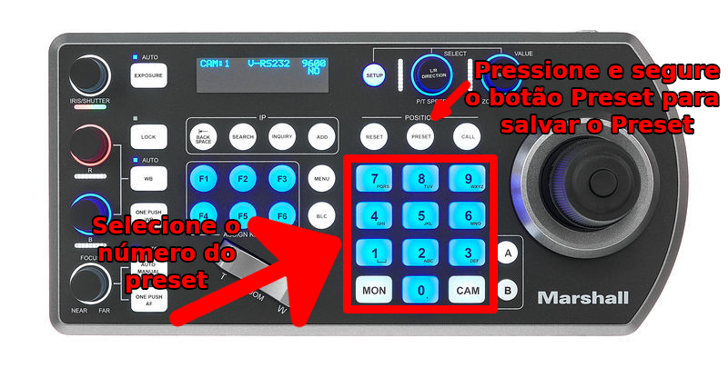

# Tarefas do início de culto

## Operador de câmeras

### Ligar TV central
- No celular abra o app **Video & TV SideView: Remote**.  

- Clique no icone de controle para abri o controle da TV.

- Uma tela irá aparecer simulando um controle de TV. Clique no botão **Power**

- Após isso a televisão será ligada. Porém sempre verifique, seja posicionando uma das cameras laterais na TV ou olhando nas laterais da galeria.

### Testar o controlador das câmeras {#testar-controlador-cameras}
- No controle da câmera do teto, pressione 1111111 para habilitar o controle
- Movimente o Joystick, e verifique se a câmera do teto responde ao movimento
- Pegue o controle dos outras cameras e selecione uma camera de cada vez pressionando os botões F1, F2 e F3
- Movimente o Joystick, e verifique se a câmera selecionada responde ao movimento

Caso acha algum problema veja em [Camera não pode ser controlada](../../troubleshooting/camera-nao-pode-ser-controlada)

### Ajuste dos Preset's

É sempre bom ajustar verificar os presets da camera e ajustar quando necessário. Os principais são os dos cantores que podem diferir em altura e posição. Para fazer isso siga os passos abaixo:

1. Selecione o número do preset;
2. Ajuste o preset;
3. Pressione o botão preset e segure por cerca de 3 segundos para salvar o preset.

Desta forma as chamadas de imagem se tornaram mais rápidas
