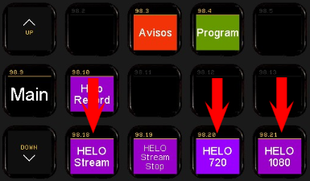
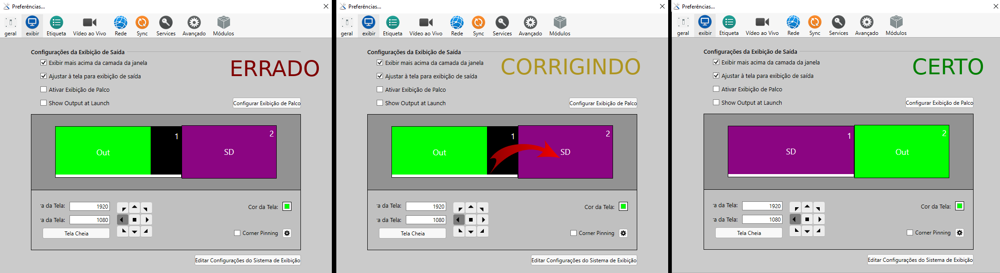

# Resolvendo problemas (Troubleshooting)
{: .no_toc}

Índice
* TOC
{:toc}
---

## Queda do link da Internet principal

Em caso de queda do link principal de internet, ou problemas de performance no streaming do YouTube, siga os procedimentos abaixo para reduzir a resolução da transmissão.
- Pressione HELO STOP para parar o streaming
- Pressione HELO 720 para mudar a resolução do streaming para uma qualidade inferior.
- Pressione HELP START para iniciar o streaming novamente.

## Internet Upload Inferior a 10Mbps

Aqui é quando a internet fica lenta, porém não caiu, isso pode fazer com que a transmissão fique parando para quem está assistindo.
Para não impactar o Streaming do YouTube, altere o profile do AJA HELO para 720, pressionando a tecla HELO 720 no Stream Deck indicada na imagem.

## ProPresenter mostrando a saída no monitor principal

Isso acontece normalmente porque os equipamentos são ligados na ordem errada.\
Importante se atentar para a ordem correta descrita [aqui](/ibcalvariotv/transmissao/tarefas-inicio-e-fim-de-culto/#ligando-os-computadores).

Uma forma de corrigir isso é entrando no menu Arquivo->Preferências do ProPresenter e arrastando a saída para o menu secundário. Depois disso feche as janela e teste novamente.

Isso está ilustrado na imagem abaixo.

## Stream Deck não funciona

- Vá até o [Mini-Mac](/ibcalvariotv/transmissao/equipamentos-e-programas#auxiliar-de-transmissao).
- Feche o [BitFocus](/ibcalvariotv/transmissao/equipamentos-e-programas#bitfocus) no Mini-mac.
Para isso clique no ícone do BitFocus na barra de cima do Desktop no Mini-Mac ([imagem](icone-bit-focus.png)).
- Clique no botão Close da janela que abriu  ([imagem](close-bitfocus.png)).
- Inicie o BitFocus novamente clicando no ícone da barra que fica embaixo no Desktop ([imagem](iniciar-bit-focus.png)).

## Navegador do PC de avisos sumiu

- Posicionar o mouse sobre o miniatura do aplicativo na barra de tarefas conforme [imagem](mover-chrome-avisos.png).
- Clicar com o botão direito do mouse em cima da miniatura e selecionar a opção "Mover".
- Aperte a seta para cima no teclado.
- Mova o mouse e perceba que está movendo a janela toda.

## Avisos não estão aparecendo

- No [computador de avisos](/ibcalvariotv/transmissao/equipamentos-e-programas/#computador-do-chat-e-avisos) mova o mouse para além da esquerda do monitor principal, perceba que o mouse está se movimentando na tela de avisos do [Multi-View](/ibcalvariotv/transmissao/equipamentos-e-programas#monitor-multi-view).
- Procurar por uma janela preta, no monitor principal ou no Multi-View (ver [imagem](avisos-no-multiview.jpg)).
- Clicando e segurando o botão do mouse sobre a barra de título, mova a janela para o segundo monitor (tela no Multi-view).
- Caso as bordas e título da janela estejam aparecendo, selecionar a janela e pressionar F11 pra ocupar a tela toda.

## PC de avisos está com a tela toda preta

- Pressione a tecla F11.
- Mova o mouse para além da esquerda do monitor principal, perceba que o mouse está se movimentando na tela de avisos do [Multi-View](/ibcalvariotv/transmissao/equipamentos-e-programas#monitor-multi-view).
- Procure por uma janela preta, no monitor principal ou no Multi-View (ver [imagem](avisos-no-multiview.jpg)).
- Clicando e segurando o botão do mouse sobre a barra de título, mova a janela para o segundo monitor (tela no Multi-view).
- Caso as bordas e título da janela estejam aparecendo, selecionar a janela e pressionar F11 pra ocupar a tela toda.

## O Stream Deck está estranho, algumas coisa não funcionam como deveria

- Aperte o botão Tela Padrão, que ajusta o BitFocus para um estado inicial.
- Espere dois ou três segundos.
- Tente novamente.

## Projetor não liga

- Para ligar o projetor, primeiro tentamos ligar pelo navegador no Mac-Mini.
- Se não funcionar tentamos ligar pelo aplicativo do celular que funciona via Wifi.
- Se não funcionar então pode ser que tenha algum problema com a rede, então é necessário ligar pelo controle remoto que fica na gaveta.

## TV não liga

- Idem ao projetor, se não funcionar pelo celular, tente pelo controle remoto localizado na gaveta.

## Controlador não está mexendo/operando a câmera

Clique [aqui](camera-nao-pode-ser-controlada) para ver sobre como resolver esse problema.

## Itens pendentes a definir troubleshooting

- Câmera perdendo foco constantemente
- Branco da câmera está muito forte
- Vermelho do carpete está rosa
- Comunicador parou de funcionar
- Som do vídeo de abertura "estourando"